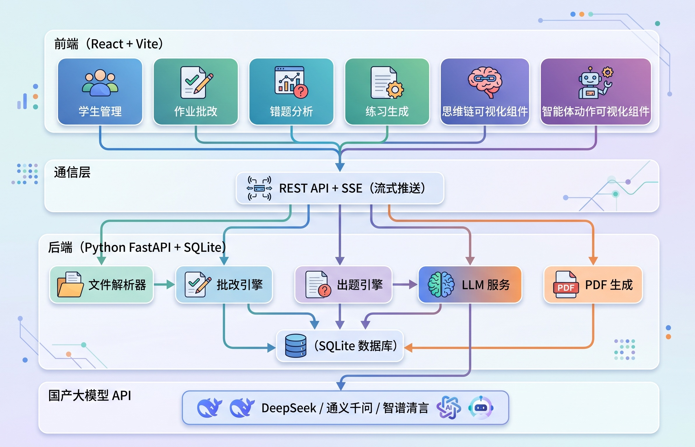

# 🎓 教育智能体 · 智能作业批改与分层练习系统

基于**国产大模型**（DeepSeek / 通义千问 / 智谱清言）驱动的 AI 教育智能体，面向中小学教师，实现**作业智能批改 → 错题自动诊断 → 个性化分层练习生成**的全流程闭环。

---

## ✨ 核心功能

| 功能模块 | 说明 |
|---------|------|
| 📝 **作业批改** | 支持手写图片拍照、PDF、Word、纯文本等多格式输入，AI 多模态识别并逐题批改 |
| 📊 **错题分析** | 自动提取错题，按知识点和错误类型分类统计，可视化图表呈现 |
| 👤 **学情画像** | 汇总学生历史数据，展示得分趋势、薄弱知识点分布、错误类型占比 |
| 🎯 **分层练习生成** | 根据学生个体错题数据，生成"基础巩固—能力提升—拓展挑战"三层个性化练习 |
| 📄 **PDF 导出** | 一键导出可打印的个性化练习卷和错题报告 |
| 🤖 **智能体可视化** | 实时展示 AI 思维链和工作流程，批改过程透明可见 |

---

## 🏗️ 技术架构



---

## 🔄 核心业务闭环


---

## 🚀 快速开始

### 环境要求

- Python 3.10+
- Node.js 18+
- npm 9+

### 安装步骤

```bash
# 1. 克隆仓库
git clone https://github.com/Zhangming0304/teach_agent.git
cd teach_agent

# 2. 安装后端依赖
cd backend
pip install -r requirements.txt

# 3. 安装前端依赖
cd ../frontend
npm install

# 4. 回到根目录，一键启动（macOS / Linux）
cd ..
bash start.sh
```

启动后打开浏览器访问：**http://localhost:5173**

### 配置大模型 API

首次使用需在侧边栏底部「API 配置」页面配置国产大模型的 API 密钥：

| 服务商 | API 端点 | 推荐模型 | 备注 |
|--------|---------|---------|------|
| 通义千问 | `https://dashscope.aliyuncs.com/compatible-mode/v1` | **qwen3.6-plus** | ⭐ 推荐，多模态大模型，支持图片识别 |
| DeepSeek | `https://api.deepseek.com/v1` | deepseek-chat | 纯文本批改推荐 |
| 智谱清言 | `https://open.bigmodel.cn/api/paas/v4` | glm-5.1 | 多模态支持 |

> 💡 手写作业图片批改建议使用**通义千问 qwen3.6-plus**，它是多模态大模型，图片识别效果最佳。

系统支持任何兼容 OpenAI 格式的国产大模型 API。

---

## 📁 项目结构

```
teach_agent/
├── start.sh                    # 一键启动脚本
├── backend/                    # 后端（Python）
│   ├── app.py                  # FastAPI 主应用，定义所有 API 路由
│   ├── database.py             # SQLite 数据库操作
│   ├── llm_service.py          # 大模型交互服务（批改、出题、流式输出）
│   ├── file_parser.py          # 多格式文件解析（图片/PDF/Word/TXT）
│   ├── pdf_service.py          # PDF 练习卷和错题报告生成
│   └── requirements.txt        # Python 依赖清单
├── frontend/                   # 前端（React + TypeScript）
│   ├── index.html              # HTML 入口
│   ├── package.json            # 前端依赖配置
│   ├── vite.config.ts          # Vite 构建配置（含 API 代理）
│   └── src/
│       ├── App.tsx             # 路由定义
│       ├── index.css           # 全局样式（温暖教育风设计系统）
│       ├── types.ts            # TypeScript 类型定义
│       ├── api/client.ts       # API 请求封装
│       ├── components/         # 布局组件
│       │   ├── Layout.tsx      # 全局布局（侧边栏 + 主内容区）
│       │   └── Sidebar.tsx     # 侧边导航栏
│       └── pages/              # 页面组件
│           ├── Dashboard.tsx   # 工作台首页
│           ├── Students.tsx    # 学生管理
│           ├── Grading.tsx     # 作业批改（核心页面）
│           ├── ErrorAnalysis.tsx # 错题分析与学情画像
│           ├── PracticeGenerator.tsx # 分层练习生成
│           └── Settings.tsx    # API 配置
├── docs/                       # 文档图片
└── 学生作业-示例.jpg             # 示例作业图片（可用于测试）
```

---

## 🔑 核心设计

### 提示词工程（Prompt Engineering）

系统的核心在于两套精心设计的提示词模板：

- **批改提示词**：要求大模型以专业教师身份逐题分析，输出包含题目内容、学生答案、正确答案、错误类型（计算错误/概念错误/粗心大意/方法错误/审题错误/步骤缺失）、知识点、难度等级的结构化 JSON
- **出题提示词**：注入学生个人错题画像数据（历史得分趋势、高频薄弱知识点、错误类型分布），按"基础巩固—能力提升—拓展挑战"三层结构生成个性化练习题

### SSE 流式通信

采用 Server-Sent Events（SSE）技术实现智能体思维链的实时可视化：

```
文件接收 → 文件解析 → 内容识别 → 逐题批改 → 错误分析 → 报告生成 → 错题入库
```

每个步骤的状态和进度信息同步推送到前端界面，让 AI 批改过程透明可见。

### 多格式文件解析

通过 `file_parser.py` 模块自动判断文件类型并走不同处理路径：
- **图片**（JPG/PNG/WebP）→ 多模态视觉识别
- **PDF 扫描件** → 导出为图片，走视觉识别
- **PDF 文字件** → 提取文字，走纯文本批改
- **Word 文档**（.docx）→ 提取文字，走纯文本批改
- **纯文本**（.txt）→ 直接批改

---

## 📜 许可证

[MIT License](LICENSE)

---

## 🙏 致谢

本项目借助以下国产大模型和开源技术构建：
- [通义千问](https://tongyi.aliyun.com/) — 阿里云多模态大模型（推荐）
- [DeepSeek](https://www.deepseek.com/) — 国产大语言模型
- [智谱清言](https://open.bigmodel.cn/) — 智谱 AI 大模型
- [React](https://react.dev/) — 前端框架
- [FastAPI](https://fastapi.tiangolo.com/) — Python Web 框架
